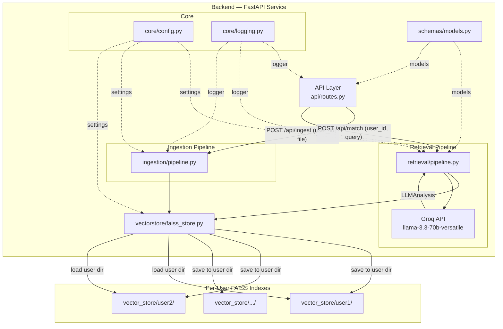
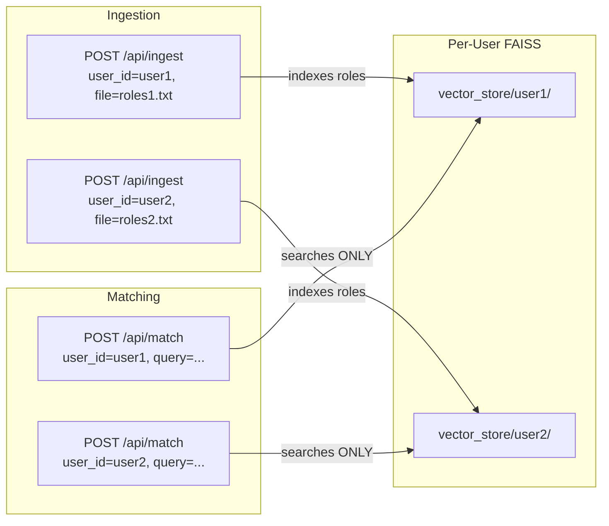
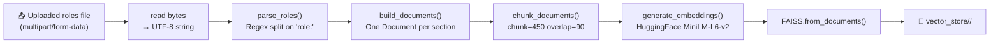
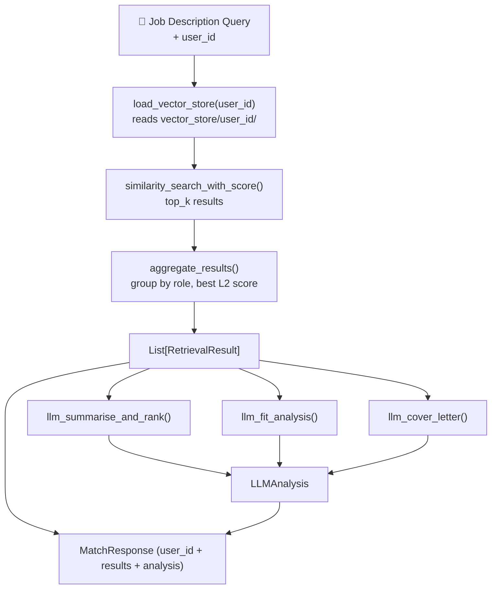
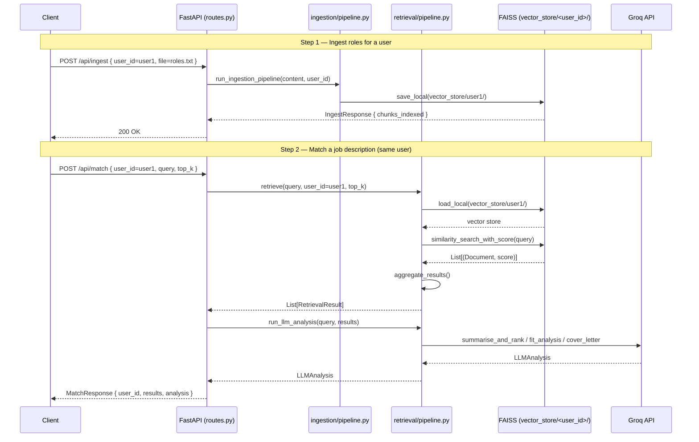
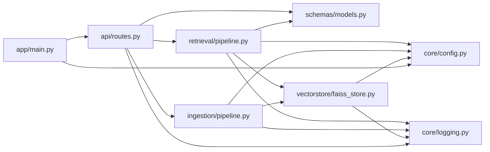
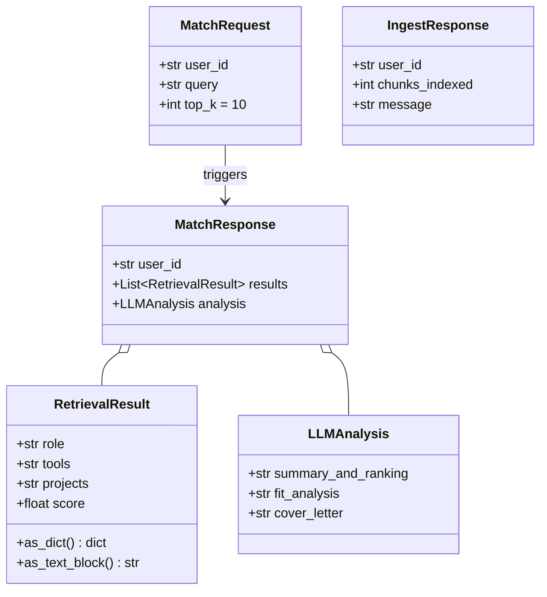

# Role RAG Service — Design Document

## Overview

The Role RAG Service is a **multi-user Retrieval-Augmented Generation** pipeline.
Each user has an **isolated FAISS vector index**. Ingestion and retrieval are always
scoped by `user_id` — no cross-user data leakage is possible.

---

## System Architecture

---

## Multi-User Isolation

---

## Ingestion Pipeline

| Step | Function | Output |
|------|----------|--------|
| 1 | API reads `UploadFile` | Raw UTF-8 content |
| 2 | `parse_roles()` | `List[Dict]` — one dict per role |
| 3 | `build_documents()` | `List[Document]` — one per section |
| 4 | `chunk_documents()` | Smaller `List[Document]` chunks |
| 5 | `save_vector_store(user_id)` | FAISS index at `vector_store/<user_id>/` |

---

## Retrieval Pipeline

---

## API Request-Response Flow

---

## Module Dependency Graph

---

## Data Models

---

## Configuration Reference

| Variable | Default | Description |
|---|---|---|
| `GROQ_API_KEY` | _(required)_ | Groq API authentication key |
| `GROQ_MODEL` | `llama-3.3-70b-versatile` | LLM model identifier |
| `EMBEDDING_MODEL_NAME` | `sentence-transformers/all-MiniLM-L6-v2` | HuggingFace embedding model |
| `VECTOR_STORE_PATH` | `vector_store` | Root directory for all per-user FAISS indexes |
| `CHUNK_SIZE` | `450` | Token chunk size for the text splitter |
| `CHUNK_OVERLAP` | `90` | Overlap between adjacent chunks |
| `HOST` | `0.0.0.0` | FastAPI server bind host |
| `PORT` | `8000` | FastAPI server bind port |
| `RELOAD` | `true` | Enable uvicorn hot-reload |

---

## Technology Stack

| Layer | Technology |
|---|---|
| API Framework | FastAPI + Uvicorn |
| Validation | Pydantic v2 |
| Vector Store | FAISS (CPU), one index per user |
| Embeddings | HuggingFace `all-MiniLM-L6-v2` |
| LLM | Groq — `llama-3.3-70b-versatile` |
| Text Splitting | LangChain `RecursiveCharacterTextSplitter` |
| Containerisation | Docker |
